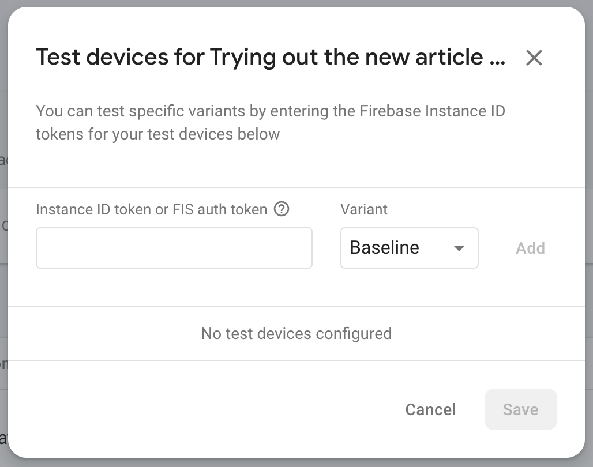

# firebase_device_id

Helper to get the firebase device ID to use for remote config testing.

## Why use this project?

Quite probably, if you have come so far as to begin using AB tests in your Firebase setup, likely, you have also got Firebase messaging set up.

If this is the case and you want to try your AB tests using specific device tokens, go ahead and [FCM token](https://flutteragency.com/how-to-get-firebase-token-in-flutter/) to identify your device for testing.



If you want to get this token without relying on cloud messaging however, you can do so using the `Firebase installation` package which comes bundled with [firebase_core](https://pub.dev/packages/firebase_core).

This project packages a solution, even if crude, and shows a practical example of how to get this token.

## Usage

```dart
final token = await getDeviceToken();
```